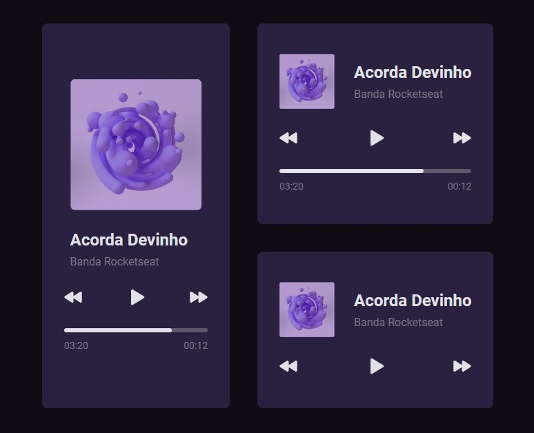

<!-- Please update value in the {}  -->

<h1 align="center">Music Player - Desafio Semana 1 #boraCodar</h1>

    Solução para o desafio da semana 1 do <a href="https://boracodar.dev/" target="_blank">BoraCodar.dev</a>

  <h3>
    <a href="https://63bf62716f21ad689e6b5bc2--superlative-kulfi-03e25d.netlify.app/">
      Demo
    </a>
     | 
    <a href="https://github.com/viniborges/music-player">
      Solução
    </a>
     | 
    <a href="https://boracodar.dev/">
      Desafio
    </a>
  </h3>

## Overview
Neste desafio aprendi um pouco sobre como iniciar um projeto React usando o Vite, além de desenvolver e estilizar componentes usando módulos CSS.

Agradeço a mentoria do grande <a href="https://github.com/thrsouza" target="_blank">Thiago Souza</a> :purple_heart:

### Built With

- React
- Vite
- Typescript

## Contact

- GitHub [@viniborges](https://github.com/viniborges)
- Linkedin [luisvinicius](https://https://www.linkedin.com/in/luisvinicius/)
